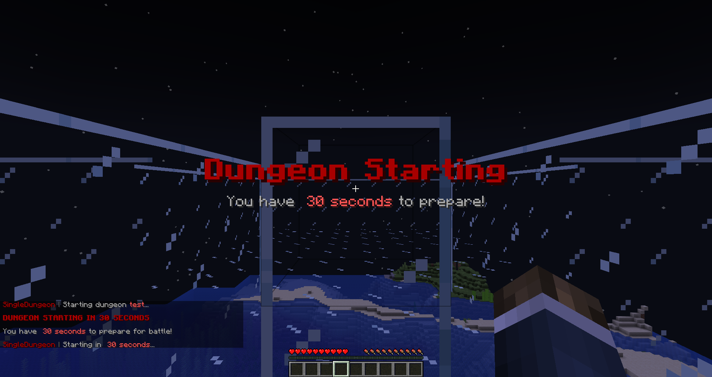
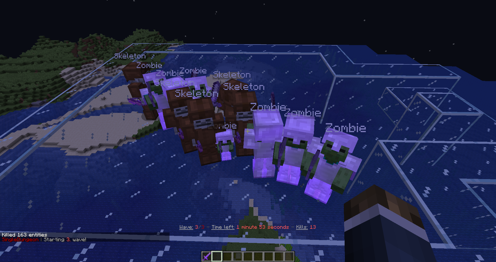
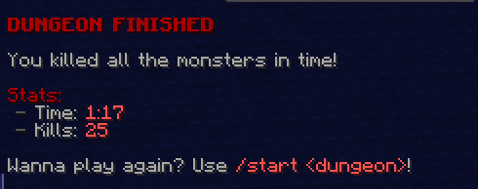
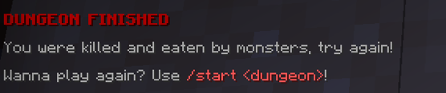

# SingleDungeon

SingleDungeon is a simple single-player dungeon mini-game.

Messages, dungeons, waves and monsters are all configurable. There are 4 files for
each category. Player stats are stored in a database (MongoDB).

## Config

### Messages

**Placeholders:**
- `{prefix}`: Prefix of the plugin (configurable in config.yml).
- `{player}`: Players name.
- `{dungeon}`: Players current dungeon.
- `{wave}`: Players current wave.
- `{waves}`: Total waves of the dungeon.
- `{kills}`: The amount of monsters killed.
- `{time}`: Current time formatted. (mm:ss)
- `{time_long}`: Current time formatted. (m minutes s seconds)
- `{time_seconds}`: Current time as seconds.
- `{took}`: How long the dungeon took so far formatted. (mm:ss)
- `{took_long}`: How long the dungeon took so far formatted. (m minutes s seconds)

## Screenshots

1) Starting a dungeon  
2) Waves  
3) Win  
4) Loss  